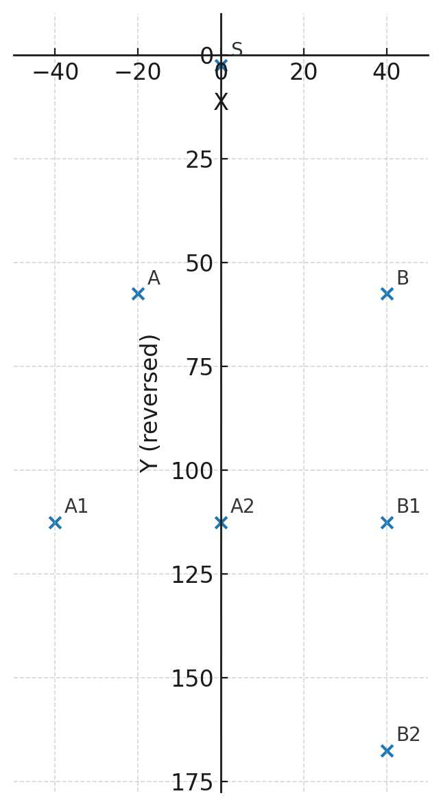

[](https://github.com/Lemutec/Lemutec.GraphSharp/blob/master/LICENSE) [](https://nuget.org/packages/Lemutec.GraphSharp) [](https://github.com/Lemutec/Lemutec.GraphSharp/actions/workflows/build.yml)

# GraphSharp

Forked from [graphsharp](https://github.com/highway-it/graphsharp)

e.g.

```c#
using GraphSharp;
using GraphSharp.Algorithms.Layout.Simple.Hierarchical;
using QuickGraph;

var g = new BidirectionalGraph<string, Edge<string>>(true);
g.AddVertexRange(new[] { "S", "A", "B", "A1", "A2", "B1", "B2" });
g.AddEdge(new Edge<string>("S", "A"));
g.AddEdge(new Edge<string>("S", "B"));
g.AddEdge(new Edge<string>("A", "A1"));
g.AddEdge(new Edge<string>("A", "A2"));
g.AddEdge(new Edge<string>("B", "B1"));
g.AddEdge(new Edge<string>("B1", "B2"));

var vertexSizes = new Dictionary<string, Size>
{
    ["S"] = new Size(10, 5),
    ["A"] = new Size(10, 5),
    ["A1"] = new Size(10, 5),
    ["A2"] = new Size(10, 5),
    ["B"] = new Size(10, 5),
    ["B1"] = new Size(10, 5),
    ["B2"] = new Size(10, 5),
};

var parameters = new EfficientSugiyamaLayoutParameters
{
    LayerDistance = 50,
    VertexDistance = 30,
    EdgeRouting = SugiyamaEdgeRoutings.Orthogonal,
    PositionMode = -1,
    MinimizeEdgeLength = true,
    OptimizeWidth = true,
};

var layoutAlgorithm = new EfficientSugiyamaLayoutAlgorithm<string, Edge<string>, BidirectionalGraph<string, Edge<string>>>(g, parameters, vertexSizes);

layoutAlgorithm.Compute();

var vertexPositions = layoutAlgorithm.VertexPositions;

foreach (var kvp in vertexPositions)
{
    Debug.WriteLine($"Vertex {kvp.Key}: X={kvp.Value.X:F2}, Y={kvp.Value.Y:F2}");
}

var edgeRoutes = layoutAlgorithm.EdgeRoutes;
foreach (var kvp in edgeRoutes)
{
    Debug.WriteLine($"Edge {kvp.Key}: has {kvp.Value?.Length ?? 0} route points");
    if (kvp.Value != null)
    {
        for (int i = 0; i < kvp.Value.Length; i++)
        {
            Debug.WriteLine($"  Route points {i}: X={kvp.Value[i].X:F2}, Y={kvp.Value[i].Y:F2}");
        }
    }
}
```


